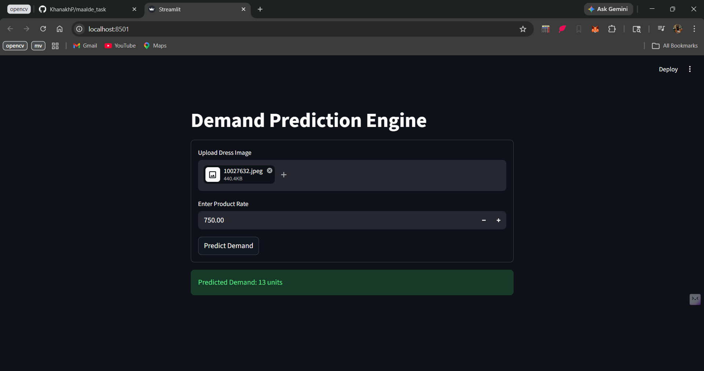
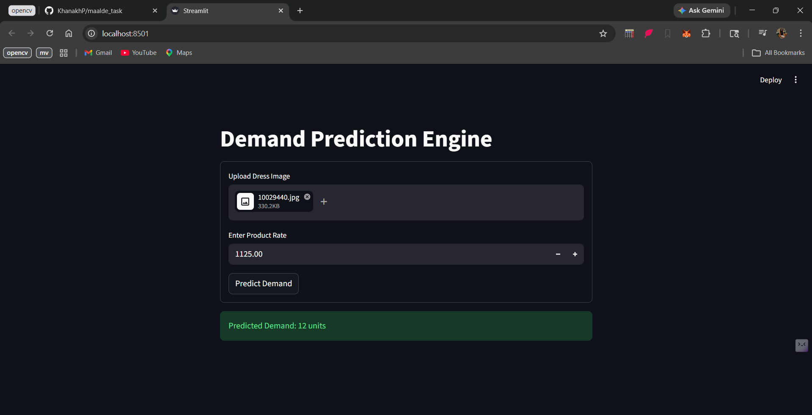

# AI-Based Dress Demand Prediction System

<<<<<<< HEAD
Full Name: `Khanakh Prajapati`

Mobile No: `9313212890`
=======
## Full Name
Khanakh Prajapati

## Mobile Number
9313212890
>>>>>>> 1d234b6 (Added hybrid similarity retrieval and Streamlit UI improvements)

---

# Project Overview

This project is an AI/ML-based Dress Demand Prediction System that predicts the expected quantity sold for a new dress design using:

- Dress Images
- Historical Sales Data
- Product Pricing Information

The system uses computer vision, embedding extraction, dimensionality reduction, similarity retrieval, and machine learning to estimate demand.

---

# Features

## Dress Validation
Before prediction, the system validates whether the uploaded image is actually a dress-related image.

Examples:
- Dress → Accepted
- Saree → Accepted
- T-shirt → Rejected
- Sunglasses → Rejected

---

## OCR-Based Image Renaming
The system extracts dress codes from images using OCR and renames images automatically.

---

## Embedding Generation
The project uses FashionCLIP to extract semantic image embeddings representing:
- Color
- Pattern
- Style
- Design Features

---

## PCA Dimensionality Reduction
Since embeddings are high-dimensional and dataset size is small, PCA is used to:
- Reduce noise
- Improve generalization
- Reduce overfitting

Two PCA configurations were tested:
- PCA-32
- PCA-64

---

## Demand Prediction
The final prediction system uses:
- XGBoost Regression
- Similarity-Based Retrieval

Final prediction is generated using a hybrid approach:
- 70% XGBoost prediction
- 30% Similarity retrieval prediction

---

## Similarity Retrieval
The system retrieves visually similar dresses from historical data using cosine similarity on PCA embeddings.

This improves:
- Explainability
- Stability
- Small dataset performance

---

## Streamlit UI
A simple UI is built using Streamlit where users can:
1. Upload dress image
2. Enter product price
3. Get predicted quantity sold
4. View similar historical dresses

---

# Tech Stack

| Technology | Purpose |
|---|---|
| Python | Core development |
| Streamlit | UI |
| FashionCLIP | Image embeddings |
| XGBoost | Demand prediction |
| PCA | Dimensionality reduction |
| Scikit-learn | ML utilities |
| OpenCV | Image preprocessing |
| Tesseract OCR | Code extraction from images |
| NumPy/Pandas | Data handling |

---

# Challenges Faced

```text
<<<<<<< HEAD
.
|-- AI ML Task Sheet.xlsx      # Raw Excel file with readme and sales data sheets
|-- images/                    # Original product images
|-- renamed_images/            # Product images renamed by product code
|-- data/
|   |-- processed_data.csv     # Aggregated code, total_qty, avg_rate
|   |-- model_dataset.csv      # Final training rows, only products with matching images
|   |-- X.npy                  # Model input features
|   `-- y.npy                  # Target quantities
|-- models/
|   |-- model.pkl              # Trained demand prediction model
|   `-- model_info.pkl         # Model metadata
|-- scripts/
|   |-- prepare_data.py        # Cleans and aggregates sales data
|   |-- build_dataset.py       # Builds image + rate feature dataset
|   |-- train.py               # Trains and saves the model
|   `-- extract_and_rename.py  # Optional OCR utility for image renaming
|-- src/
|   `-- demand_predictor/      # Main reusable ML package
|-- app.py                     # Streamlit UI
|-- requirements.txt
`-- README.md
```

## Setup Instructions

Create and activate a virtual environment:

```powershell
python -m venv .venv
.\.venv\Scripts\activate
```

Install dependencies:

```powershell
pip install -r requirements.txt
```

Prepare sales data:

```powershell
python scripts/prepare_data.py
```

Build the image and rate feature dataset:

```powershell
python scripts/build_dataset.py
```

Train the model:

```powershell
python scripts/train.py
```

Run the UI:

```powershell
streamlit run app.py
```

Open the local URL shown by Streamlit, usually:

```text
http://localhost:8501
```

## Approach and Execution

1. I first read the sales data from the Excel file and cleaned the column names.
2. I grouped sales by product `code` to calculate total quantity sold and average selling rate.
3. Product images were matched with sales rows using the product code in the filename.
4. Rows without a matching image were skipped from model training because image features could not be created for them.
5. I used pretrained ResNet50 to extract visual features from each product image.
6. Since ResNet produces high-dimensional image features, I reduced them using PCA.
7. I added rate-based features: `rate`, `log_rate`, and `normalized_rate`.
8. I trained a Random Forest regression model to predict total quantity sold.
9. I built a Streamlit UI where a user uploads a new design image, enters rate, and clicks a button to predict demand.

## How the Prediction System Works

The prediction system has three main stages:

1. **Data preparation**

   The sales data is grouped by product code. For every product, the system calculates:

   ```text
   total_qty = total quantity sold
   avg_rate = weighted average selling rate
   ```

2. **Feature extraction**

   For each matching product image, ResNet50 extracts visual features such as shape, color, style, and design patterns. These image features are combined with price-related features.

3. **Model prediction**

   The trained Random Forest model receives:

   ```text
   image features + rate + log_rate + normalized_rate
   ```

   It returns the predicted quantity that the product design may sell.

## Patterns Found in the Data

- Some product designs have much higher sales quantity than others, so demand is not evenly distributed.
- Product rates are mostly within a limited range, with many products around mid-range prices.
- Some product codes in sales data do not have matching product images.
- Similar-looking designs can still have different sales quantities, which means image alone is not enough for perfect prediction.
- Rate has an effect, but the dataset is small, so price-demand behavior is not very strong or fully reliable.

## Where the System Can Fail

- It can fail if the uploaded design image is very different from past product images.
- It can fail if the product rate is far outside the historical rate range.
- It can fail if images are poor quality, cropped, blurry, or do not clearly show the design.
- It can fail when product code and image filename do not match.
- The dataset is small, so the model may not generalize well to completely new design styles.
- It predicts demand from historical sales only and does not consider season, trend, stock availability, marketing, discounts, or customer segment.

## Improvements With More Time

- Collect more historical sales data and more product images.
- Add more features such as category, fabric, color, season, launch date, discount, and stock availability.
- Use a validation strategy based on time, so older products train the model and newer products test it.
- Fine-tune a deep learning model on product images instead of using only pretrained image embeddings.
- Add explainability to show which factors influenced each prediction.
- Improve OCR/image renaming so all sales rows can be matched with correct product images.
- Deploy the app online for easier testing.

## Current Training Result

Latest model result:

```text
Training samples: 143
Skipped products without images: 3
MAE: 12.50
R2 score: 0.326
```

`data/processed_data.csv` keeps all products from Excel. `data/model_dataset.csv`, `data/X.npy`, and `data/y.npy` include only products that have matching images.

## Sample Outputs

```text
Sample Output 1
Image/Product Code: 10027632
Input Rate: 750
Predicted Quantity: 13
Actual Quantity: 12
```


```text
Sample Output 2
Image/Product Code: 10029440
Input Rate: 1125
Predicted Quantity: 12
Actual Quantity, if known: 10
```



## UI Usage

1. Run the app using `streamlit run app.py`.
2. Upload a product design image.
3. Enter the expected product rate.
4. Click **Predict Demand**.
5. The app displays predicted demand in units.
=======
>>>>>>> 1d234b6 (Added hybrid similarity retrieval and Streamlit UI improvements)

Very small dataset size
Noisy demand labels
Weak correlation between visual features and sales
OCR inconsistencies in image codes
Overfitting risk due to high-dimensional embeddings